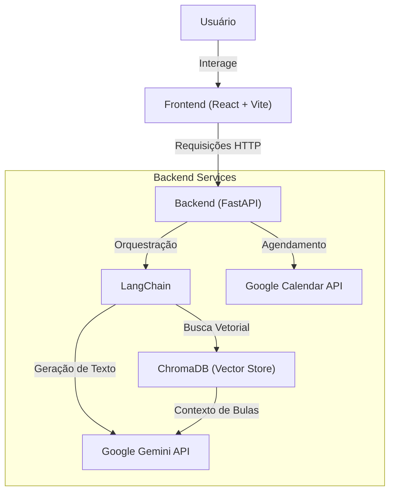

# 💊 Buliçoso | Seu Assistente de Saúde Inteligente

> **Transformando o cuidado com a medicação: simples, seguro e inteligente.**

O **Buliçoso** é um assistente de saúde inteligente desenvolvido para a disciplina de Extensão 3. Nosso objetivo é resolver dois problemas críticos enfrentados por pacientes, especialmente idosos: a complexidade das bulas de medicamentos e o esquecimento de horários.

Utilizando o poder da Inteligência Artificial Generativa (**Google Gemini**) e técnicas avançadas como **RAG (Retrieval-Augmented Generation)**, o Buliçoso desmistifica a linguagem médica e automatiza a organização da rotina de saúde.

---

## ✨ Funcionalidades Principais

### 1. 📖 Simplificação de Bulas (RAG Híbrido)
Esqueça as letras miúdas e termos técnicos.
*   **Como funciona:** O usuário envia o nome do medicamento (ou PDF da bula).
*   **O que faz:** O sistema utiliza uma base de dados vetorial (**ChromaDB**) para encontrar as informações relevantes e o **Google Gemini** para reescrevê-las em linguagem natural e acessível.
*   **Resultado:** Um resumo claro focando no que importa: **Para que serve**, **Como usar** e **Efeitos colaterais**.

### 2. ⏰ Agente de Lembretes (Tool-Calling)
Nunca mais esqueça uma dose.
*   **Como funciona:** O usuário diz ou digita sua prescrição de forma natural (ex: *"Tomar Dipirona de 8 em 8 horas por 3 dias"*).
*   **O que faz:** O Gemini atua como um Agente Inteligente, extrai os parâmetros temporais e aciona a API do **Google Calendar**.
*   **Resultado:** Lembretes automáticos criados na agenda do usuário, com notificações precisas.

---

## 🏗️ Arquitetura do Sistema

O projeto é dividido em dois componentes principais: um Backend robusto em Python e um Frontend moderno em React.



---

## 🛠️ Tech Stack

### Backend
*   **Framework:** [FastAPI](https://fastapi.tiangolo.com/) - Alta performance e fácil documentação.
*   **IA & LLM:** [Google Gemini](https://deepmind.google/technologies/gemini/) via [LangChain](https://python.langchain.com/).
*   **Banco de Dados Vetorial:** [ChromaDB](https://docs.trychroma.com/) - Para busca semântica eficiente.
*   **Integrações:** Google Calendar API (OAuth2).
*   **Gerenciamento de Dependências:** `pip` / `requirements.txt`.

### Frontend
*   **Framework:** [React](https://react.dev/) (v18).
*   **Build Tool:** [Vite](https://vitejs.dev/) - Rápido e leve.
*   **Linguagem:** [TypeScript](https://www.typescriptlang.org/) - Tipagem estática para segurança.
*   **Estilização:** CSS Modules / Tailwind (conforme implementação).

### GitOps
*   **CI:** GitHub Actions. 
*   Por questões de organização, dividimos o projeto em dois repositórios: um dedicado ao backend e outro ao frontend. Entretanto, para facilitar a integração e o controle das versões, configuramos um fluxo no GitHub Actions que sincroniza automaticamente as atualizações do frontend (https://github.com/esterfanecamelo/Bulicoso_frontEnd) com o repositório principal do projeto.
---

## 🚀 Como Executar o Projeto

### Pré-requisitos
*   **Python 3.11+**
*   **Node.js 18+**
*   **Chave de API do Google Gemini**
*   **Credenciais OAuth2 do Google** (para o Calendar)

### 1. Configuração do Backend

1.  Navegue até a pasta do backend:
    ```bash
    cd Backend
    ```

2.  Crie e ative o ambiente virtual:
    ```bash
    python -m venv venv
    # Windows
    venv\Scripts\activate
    # Linux/Mac
    source venv/bin/activate
    ```

3.  Instale as dependências:
    ```bash
    pip install -r requirements.txt
    ```

4.  Configure as variáveis de ambiente:
    *   Copie o arquivo de exemplo: `cp .env.example .env`
    *   Edite o `.env` com suas chaves (`GOOGLE_API_KEY`, `GOOGLE_CLIENT_ID`, etc).

5.  Execute o servidor:
    ```bash
    uvicorn app.main:app --reload
    ```
    *   O Backend rodará em: `http://localhost:8000`
    *   Documentação Swagger: `http://localhost:8000/docs`

### 2. Configuração do Frontend

1.  Navegue até a pasta do frontend:
    ```bash
    cd frontend
    ```

2.  Instale as dependências:
    ```bash
    npm install
    ```

3.  Execute o servidor de desenvolvimento:
    ```bash
    npm run dev
    ```
    *   O Frontend rodará geralmente em: `http://localhost:5173`

---

## 📁 Estrutura de Pastas

```
Extensao-3/
├── Backend/                # API e Lógica de IA
│   ├── app/
│   │   ├── api/            # Endpoints (Rotas)
│   │   ├── core/           # Configurações
│   │   ├── services/       # Lógica de Negócio (RAG, Calendar)
│   │   └── ...
│   ├── Dockerfile
│   └── requirements.txt
├── frontend/               # Interface do Usuário
│   ├── src/
│   ├── package.json
│   └── ...
└── README.md               # Documentação Principal
```

---

## 🤝 Contribuição

Este é um projeto acadêmico open-source. Sinta-se à vontade para abrir Issues ou Pull Requests para melhorias.

## 📄 Licença

Distribuído sob a licença MIT. Veja `LICENSE` para mais informações.